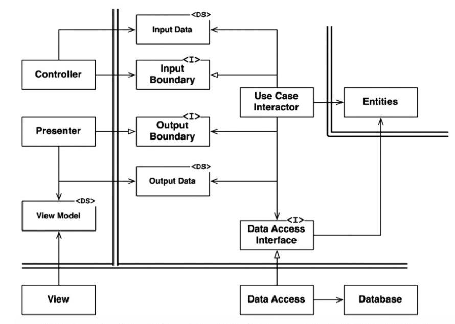

# システム構成

## 01. アーキテクチャ概要

- クリーンアーキテクチャに基づく実装

## 02. Domain 層

### Entities

- 値オブジェクトの定義と業務知識を記述する.
- 集約オブジェクトパッケージ:  `internal/domain`
- 値オブジェクトパッケージ: `internal/domain/*`

## 03. Usecase 層

- パッケージ: `internal/usecase` , `internal/usecase/*`

### Input Boundary

- ユースケースの定義を記述する.
- インターフェイスの定義のみを記述する.

### Input Data

- `Input Boundary` の処理のパラメータオブジェクトの定義.
- バリデーション処理のみ記述する.

### Output Boundary

- 出力処理の定義を記述する.
- インターフェイスの定義のみを記述する.

### Output Data

- `Output Boundary` の処理のパラメータオブジェクトの定義.

### Use Case Interactor

- `Input Boundary` の実装.
- 業務の手続きのロジックを記述.

### Data Access Interface

- データアクセス処理の定義.
- パラメータオブジェクトもここで定義.

## 04. Infrastructure 層

- パッケージ: `internal/infra`

### Controller

- パッケージ: `internal/infra/framework/handler`
- HTTPリクエストをユースケースのリクエストオブジェクトに変換し, 処理を呼び出す.

### Presenter

- パッケージ: `internal/infra/framework/presenter`
- `Output Boundary` の実装.
- ユースケースの処理結果をクライアントに表示する処理.

### View Model, View

- パッケージ: `internal/infra/framework/view`
- HTML の配置場所: `web/templates/*`

### Data Access, Database

- パッケージ: `internal/infra/mysql`
- `Data Access Interface` の実装.
- データベースへアクセスし, 読み取り, 書き出しを担う.

[←Back](../README.md)
